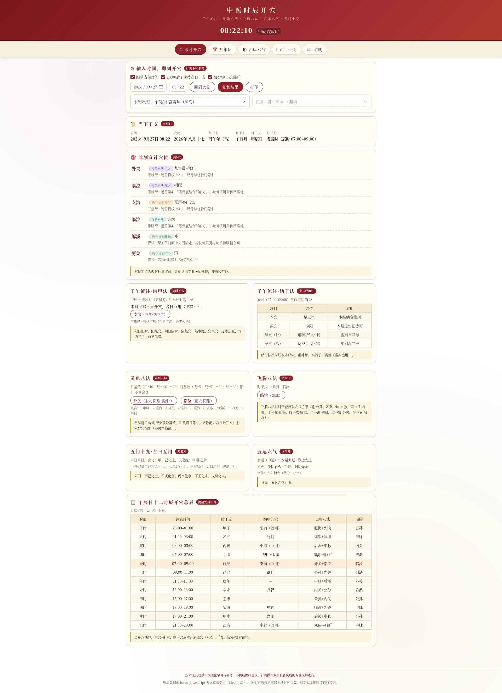
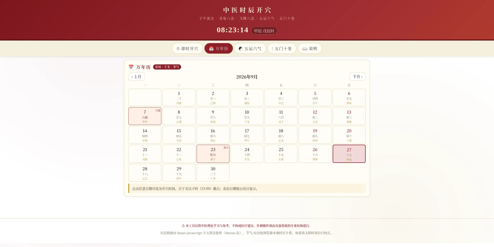
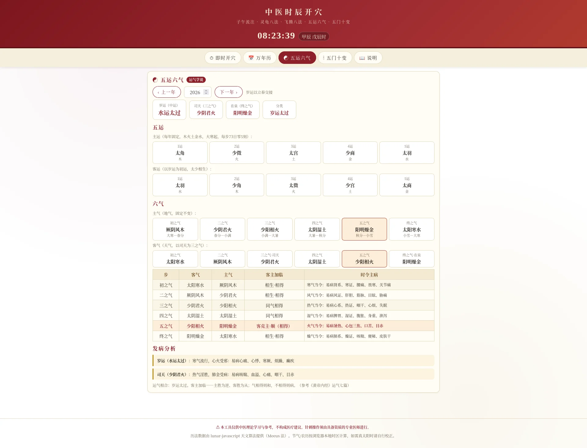

# 中医时辰开穴 · ziwu

> 子午流注 · 灵龟八法 · 飞腾八法 · 五运六气 · 五门十变

一个纯前端的中医时辰开穴综合计算器，输入时间即可查询当下宜针穴位、当令经络、五运六气与五门十变。无需后端，无需登录，打开即用。

**在线体验**：[https://acuherb.xyz/ziwu/](https://acuherb.xyz/ziwu/)

---

## ✨ 功能

- **即时开穴** — 输入任意日期时间，自动计算当前时辰的各类开穴
- **子午流注·纳甲法** — 按日干、时干、时支取穴，含返本还原与合日互用
- **子午流注·纳子法** — 十二经气血流注，本穴、原穴、补母泻子
- **灵龟八法** — 八脉交会穴按时取穴，主穴配穴相配
- **飞腾八法** — 按时干查卦取穴
- **五运六气** — 中运太过不及、司天在泉、客主加临、发病分析
- **五门十变** — 天干合化与夫妻经互用
- **万年历** — 农历、干支、节气、星期一览
- **自动刷新** — 跟随系统时间，每分钟自动更新
- **打印与复制** — 一键打印或复制结果，便于记录

---

## 🖼️ 预览

| 即时开穴 | 万年历 | 五运六气 |
| :---: | :---: | :---: |
|  |  |  |

---

## 🚀 快速开始

### 本地运行

下载仓库后直接用浏览器打开 `index.html` 即可，无需任何构建步骤。

```bash
git clone https://github.com/acuherb/ziwu.git
cd ziwu
# 直接用浏览器打开
open index.html
